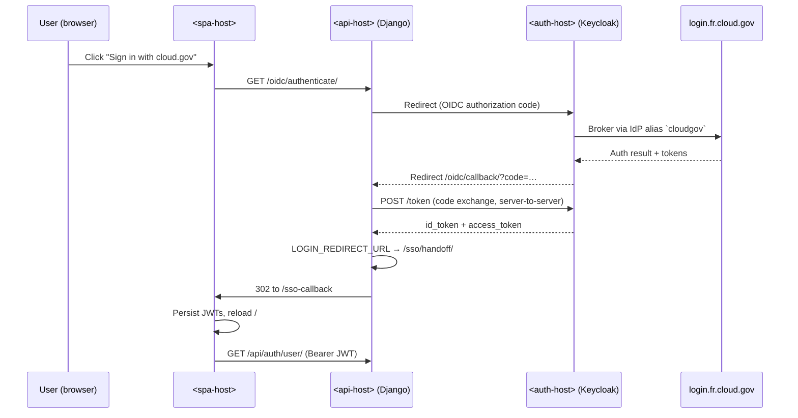

# Cloud.gov SSO with Keycloak

This guide documents the end-to-end steps to enable single sign-on (SSO) for
Precogly on cloud.gov. Users authenticate through a Keycloak realm that is
federated to `login.fr.cloud.gov` (the cloud.gov identity provider), and the
Django backend mints SimpleJWT tokens that the SPA consumes on a callback
route.

## Placeholders used below

Substitute your own cloud.gov routes for these placeholders:

- `<spa-host>` — public host serving the SPA (e.g. `myapp.app.cloud.gov`).
- `<api-host>` — public host serving the Django backend / OIDC endpoints.
- `<auth-host>` — public host serving Keycloak.
- `<realm>` — Keycloak realm name.

## Architecture



Because the SPA and API run on different cloud.gov hosts, the Django session
cookie set on the API host is invisible to the SPA. Tokens are delivered in
the URL fragment (`#…`), which is never sent to any server, then persisted
client-side for subsequent Bearer-authenticated API calls.

## Components

| Piece | Location |
|-------|----------|
| Keycloak server | `ghcr.io/gsa-tts/terraform-cloudgov/keycloak-server:latest`, deployed at `<auth-host>` |
| Realm | `<realm>` |
| Client | `<realm>-backend` (confidential, standard flow) |
| IdP alias | `cloudgov` (federated to `login.fr.cloud.gov`) |
| Django backend | `<api-host>`, settings `config.settings.cloud_gov` |
| SPA | `<spa-host>` (staticfile buildpack, or any static host) |

## Backend changes

The following backend pieces were added to complete the flow.

### `apps/core/keycloak_auth.py`

Two classes:

- `KeycloakOIDCBackend` — subclasses `mozilla_django_oidc`'s
  `OIDCAuthenticationBackend` to provision Django users from Keycloak
  `userinfo` claims (`preferred_username`, `email`, `given_name`,
  `family_name`).
- `KeycloakBearerAuthentication` — DRF authenticator that validates
  Keycloak-issued RS256 JWTs via JWKS. Returns `None` (rather than raising)
  on `PyJWTError`, so SimpleJWT HS256 tokens minted by the handoff endpoint
  fall through to `JWTAuthentication`.

### `apps/core/sso_views.py`

`SsoTokenHandoffView` (a plain Django `View`, not DRF) runs **after**
`mozilla_django_oidc` completes the authorization-code exchange and populates
`request.user`. It mints a SimpleJWT refresh + access pair with
`RefreshToken.for_user(request.user)` and returns a 302 to
`{FRONTEND_URL}/sso-callback#access=…&refresh=…&email=…&pk=…`.

### `config/urls.py`

An `_oidc_urls()` helper conditionally mounts the OIDC routes only when
`mozilla_django_oidc` is installed, so local dev without the package still
imports cleanly:

```python
def _oidc_urls():
    from apps.core.sso_views import SsoTokenHandoffView
    return [
        path("oidc/", include("mozilla_django_oidc.urls")),
        path("sso/handoff/", SsoTokenHandoffView.as_view(), name="sso-handoff"),
    ]
```

### `config/settings/cloud_gov.py`

The cloud.gov settings module wires everything together:

- OIDC endpoint URLs, client id/secret from environment.
- `FRONTEND_URL` env var drives the redirect target.
- `LOGIN_REDIRECT_URL = "/sso/handoff/"` so mozilla-django-oidc's callback
  hands off to the token minter.
- `LOGIN_REDIRECT_URL_FAILURE = FRONTEND_URL + "/login?sso=error"`.
- `OIDC_REDIRECT_ALLOWED_HOSTS = [urlparse(FRONTEND_URL).hostname]` — this
  is critical; without it, mozilla-django-oidc treats a cross-host redirect
  as unsafe and rewrites it to `/`.
- Session/CSRF cookies use `SameSite=None; Secure` so they survive
  cross-origin round-trips.
- DRF `DEFAULT_AUTHENTICATION_CLASSES` order: SimpleJWT first, Keycloak
  Bearer second, SessionAuthentication last.

### Requirements

Added to `backend/requirements/production.txt`:

- `mozilla-django-oidc`
- `PyJWT[crypto]` (for Keycloak JWT verification via JWKS)

## Frontend changes

### `pages/Login.tsx`

Renders a "Sign in with cloud.gov (Keycloak SSO)" button that navigates to
`${VITE_API_URL}/oidc/authenticate/`. Only shown when `VITE_SSO_ENABLED`
is not `false` and `VITE_API_URL` is defined.

### `pages/SsoCallback.tsx`

React route at `/sso-callback` that reads `access` and `refresh` from the URL
fragment, persists them via `setTokens()`, and does a full document
navigation to `/` so `AuthProvider` re-hydrates from `/api/auth/user/`.

Uses a `useRef` guard so React 18 Strict Mode's double-invoke does not race
the persistence step.

### `routes.tsx`

Adds `{ path: '/sso-callback', element: <SsoCallback /> }` to the public
routes.

## Environment configuration

The backend app expects these environment variables on cloud.gov (set with
`cf set-env <backend-app> …`):

| Variable | Example |
|----------|---------|
| `OIDC_OP_ISSUER` | `https://<auth-host>/realms/<realm>` |
| `OIDC_OP_AUTHORIZATION_ENDPOINT` | `…/protocol/openid-connect/auth` |
| `OIDC_OP_TOKEN_ENDPOINT` | `…/protocol/openid-connect/token` |
| `OIDC_OP_USER_ENDPOINT` | `…/protocol/openid-connect/userinfo` |
| `OIDC_OP_JWKS_ENDPOINT` | `…/protocol/openid-connect/certs` |
| `OIDC_RP_CLIENT_ID` | `<realm>-backend` |
| `OIDC_RP_CLIENT_SECRET` | *(from Keycloak client credentials)* |
| `FRONTEND_URL` | `https://<spa-host>` |
| `CSRF_TRUSTED_ORIGINS` | `https://<spa-host>` |

SPA build-time variables:

| Variable | Example |
|----------|---------|
| `VITE_API_URL` | `https://<api-host>` |
| `VITE_SSO_ENABLED` | `true` |

## Keycloak realm setup

1. **Realm**: `<realm>`.
2. **Client**: `<realm>-backend`
    - Client type: OpenID Connect
    - Client authentication: **On** (confidential)
    - Standard flow: **On**
    - Valid redirect URIs: `https://<api-host>/oidc/callback/`
    - Web origins: `https://<api-host>`
3. **Identity provider**: alias `cloudgov`
    - Type: OpenID Connect v1.0
    - Discovery URL: `https://idp.fr.cloud.gov/.well-known/openid-configuration`
    - Client ID / secret provisioned via a cloud.gov OIDC service instance.
4. Optional: add a first-broker-login flow that auto-selects the `cloudgov`
   IdP so users are not shown the Keycloak username/password form.

## Deployment gotcha: JVM IPv4/IPv6

Cloud.gov container network egress is effectively IPv6-only on the route
Keycloak uses to reach `login.fr.cloud.gov`. A default JVM prefers IPv4,
which produces `502 Bad Gateway` from Keycloak when it tries to fetch the
IdP's OIDC metadata (the IPv4 connection times out).

Fix by forcing the JVM to prefer IPv6 in the Keycloak app's environment:

```bash
cf set-env <auth-app> JAVA_OPTS "-Djava.net.preferIPv6Addresses=true -Djava.net.preferIPv4Stack=false"
cf restart <auth-app>
```

## Verification checklist

- Visit `https://<spa-host>/login`.
- Click **Sign in with cloud.gov (Keycloak SSO)**.
- Complete cloud.gov login (PIV/SSO).
- Land on `/sso-callback` briefly, then the dashboard.
- Reload the dashboard — session persists (tokens in localStorage).
- Backend logs: `GET /oidc/callback/ 302`, `GET /sso/handoff/ 302`,
  followed by `GET /api/auth/user/ 200`.

## Troubleshooting

| Symptom | Likely cause |
|---------|--------------|
| Redirect lands on `/` instead of SPA host | `OIDC_REDIRECT_ALLOWED_HOSTS` missing the SPA hostname |
| SPA shows "Signing you in…" then `/login?sso=error` | Fragment did not include `access`/`refresh` — check `/sso/handoff/` returned 302 with fragment |
| `401` on `/api/auth/user/` after handoff | `JWTAuthentication` not first in `DEFAULT_AUTHENTICATION_CLASSES`, or `KeycloakBearerAuthentication` is raising instead of returning `None` for HS256 tokens |
| Keycloak 502 on IdP redirect | JVM IPv4 preference; apply `JAVA_OPTS` fix above |
| SPA loses session on reload | `SsoCallback` did not persist tokens; verify `setTokens` writes to `localStorage` |
