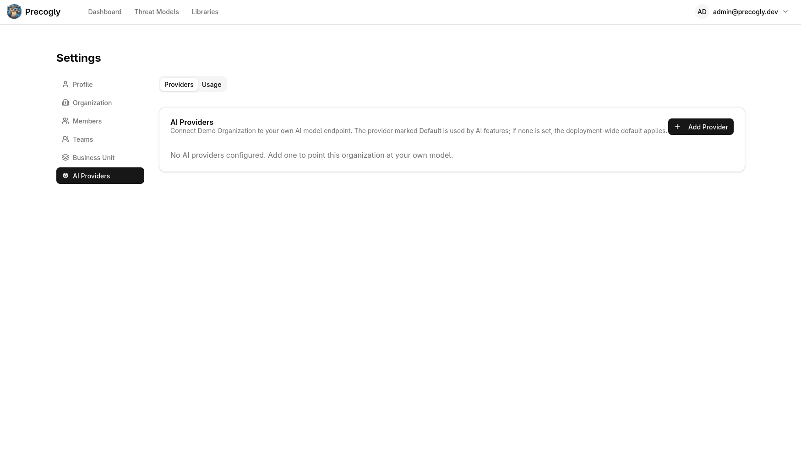
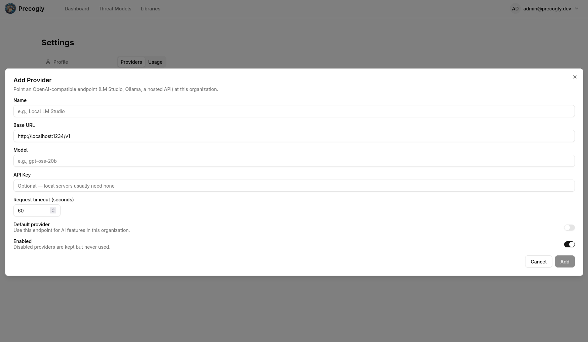
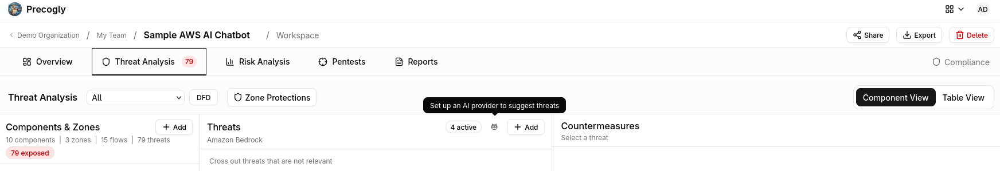

# Configuration

Precogly is configured through environment variables defined in a `.env` file at the project root. A commented example is provided at `.env.example`:

```bash
cp .env.example .env
```

For local development, Precogly works out of the box without a `.env` file — sensible defaults are built into the Docker Compose configuration. The `.env` file is only needed when you want to override defaults or deploy to production.

## Environment Variables

The values below reflect what `.env.example` provides for local development.

### Database

| Variable            | Dev Value                | Description          |
| ------------------- | ------------------------ | -------------------- |
| `POSTGRES_DB`       | `precogly`               | Database name        |
| `POSTGRES_USER`     | `precogly`               | Database user        |
| `POSTGRES_PASSWORD` | `precogly_dev_password`  | Database password    |
| `DATABASE_URL`      | `postgres://precogly:precogly_dev_password@db:5432/precogly` | Full connection string (uses `db` hostname inside Docker) |

### Django

| Variable                  | Dev Value                           | Description                |
| ------------------------- | ----------------------------------- | -------------------------- |
| `SECRET_KEY`              | `django-insecure-dev-key-change-in-production` | Django secret key |
| `DEBUG`                   | `True`                              | Enable debug mode          |
| `ALLOWED_HOSTS`           | `localhost,127.0.0.1`               | Accepted hostnames         |
| `DJANGO_SETTINGS_MODULE`  | `config.settings.development`       | Settings module to use     |

### CORS & Frontend

| Variable               | Dev Value                                       | Description                       |
| ---------------------- | ----------------------------------------------- | --------------------------------- |
| `CORS_ALLOWED_ORIGINS` | `http://localhost:5173,http://localhost`          | Origins allowed for API requests |
| `FRONTEND_URL`         | `http://localhost:5173`                          | Used for password reset links     |

## Settings Modules

Precogly uses split settings for different environments:

| Module                        | When used   | Key differences                                |
| ----------------------------- | ----------- | ---------------------------------------------- |
| `config.settings.development` | Local dev   | `DEBUG=True`, permissive CORS, debug toolbar   |
| `config.settings.production`  | Deployment  | `DEBUG=False`, HTTPS enforced, strict CORS     |

Set the active module via `DJANGO_SETTINGS_MODULE`.

## Production Deployment

Use the production Docker Compose file:

```bash
docker compose -f docker-compose.yml -f docker-compose.prod.yml up --build
```

### Required Production Variables

These **must** be set in your `.env` for production:

```bash
SECRET_KEY=your-random-secret-key-here
POSTGRES_PASSWORD=a-strong-database-password
ALLOWED_HOSTS=yourdomain.com
CORS_ALLOWED_ORIGINS=https://yourdomain.com
FRONTEND_URL=https://yourdomain.com
DJANGO_SETTINGS_MODULE=config.settings.production
```

!!! warning
    Never use the default `SECRET_KEY` or `POSTGRES_PASSWORD` in production. Generate a random secret key with:

    ```bash
    python -c "from django.core.management.utils import get_random_secret_key; print(get_random_secret_key())"
    ```

### What Production Settings Enable

The production settings module automatically configures HTTPS redirect, HSTS, secure cookies, `X-Frame-Options: DENY`, and content type sniffing protection. The frontend is served by nginx as a static bundle.

## AI Threat Suggestions (Bring Your Own Model)

Precogly can suggest threats for components using any OpenAI-compatible chat-completions endpoint. The feature is **off by default** — nothing reaches out to a model until you opt in.

### How It Works

When enabled, the AI connects Precogly to a language model that can assist with threat modeling tasks. The current implementation ranks threats from your installed library packs against each component and explains why each applies — future AI features may use different approaches depending on the task.



Provider resolution follows a two-tier chain:

1. **Per-organization config** — if the org has saved its own AI provider through the settings UI, that provider is used.
2. **Operator fallback** — the `AI_*` environment variables below. Used when an organization has no provider of its own.
3. **Disabled** — if neither is configured, AI features return a clear "not configured" response and the UI routes users to the provider setup page.

### Environment Variables

| Variable                | Default                          | Description |
| ----------------------- | -------------------------------- | ----------- |
| `AI_SUGGESTIONS_ENABLED`| `False`                          | Master switch. Set to `True` to enable the operator-wide fallback provider. |
| `AI_BASE_URL`           | `http://localhost:1234/v1`       | OpenAI-compatible base URL (the root that exposes `/chat/completions`). |
| `AI_MODEL`              | `local-model`                    | Model identifier sent in the API request. Must match what the endpoint serves. |
| `AI_API_KEY`            | _(empty)_                        | API key for the endpoint. Optional — local servers (LM Studio, Ollama) typically don't require one. |
| `AI_REQUEST_TIMEOUT`    | `60`                             | Seconds before a suggestion request times out. Increase for slower local models. |
| `AI_SECRET_KEY`         | _(empty)_                        | Fernet key that encrypts per-organization API keys at rest. Only required when orgs store their own keys via the UI. Generate with `python -c "from cryptography.fernet import Fernet; print(Fernet.generate_key().decode())"`. |

### Common Provider Configurations

**LM Studio** (local, default):

```bash
AI_SUGGESTIONS_ENABLED=True
AI_BASE_URL=http://localhost:1234/v1
AI_MODEL=local-model
```

**Ollama** (local, with OpenAI compatibility):

```bash
AI_SUGGESTIONS_ENABLED=True
AI_BASE_URL=http://localhost:11434/v1
AI_MODEL=llama3
```

**OpenAI**:

```bash
AI_SUGGESTIONS_ENABLED=True
AI_BASE_URL=https://api.openai.com/v1
AI_MODEL=gpt-4o
AI_API_KEY=sk-your-key-here
```

### Per-Organization Overrides

Organizations can bring their own model by saving an AI provider config through the settings UI (**Settings → AI Providers**). This overrides the operator fallback for that organization only. The stored API key is encrypted at rest using `AI_SECRET_KEY`.



### Using AI Suggestions

Once a provider is configured, an owl icon appears next to components in the threat analysis workspace. Click it to get AI-generated threat suggestions for that component.



!!! note
    `AI_SECRET_KEY` is separate from Django's `SECRET_KEY` so it can be rotated independently. Rotating it invalidates any stored per-org API keys, which must then be re-entered.
