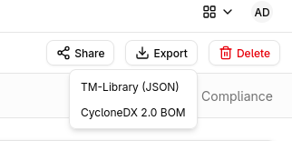
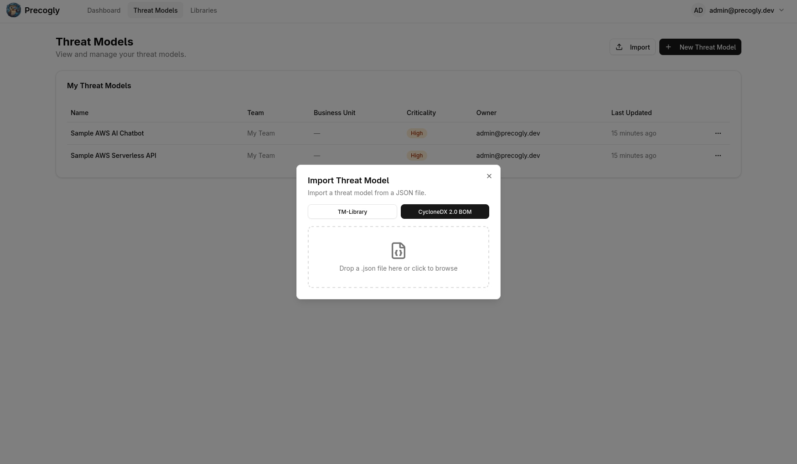

# Importing & Exporting

Precogly can export threat models as structured JSON and import them back, enabling cross-instance transfer, version-controlled threat models, and interoperability with other tools. For background on the format and version control workflows, see [Threat Model as Code](../concepts/threat-model-as-code.md).

!!! info "Supported formats"
    Precogly supports two interchange formats: the [OWASP Threat Model Library](https://github.com/OWASP/www-project-threat-model-library) JSON format (TM-Library v1.0) and the [CycloneDX 2.0 Threat Modeling BOM](https://cyclonedx.org/) (TM-BOM). TM-Library is Precogly's native format with full round-trip fidelity. CycloneDX provides industry-standard BOM interchange for use with the broader CycloneDX ecosystem.

---

## Exporting a threat model

### Steps

1. Open the threat model you want to export.
2. Click the **Export** dropdown in the toolbar.
3. Select **TM-Library (JSON)**.

The browser downloads a JSON file named after your threat model (e.g., `payment-processing-api-threat-model.json`).

### What's included

The export captures the full structural and analytical content of the threat model:

| Section | Fields |
|---------|--------|
| **Scope** | Title, description, business criticality |
| **Trust zones** | Name, description |
| **Trust boundaries** | Zone pair, access control methods, authentication methods, token configuration |
| **Actors** | Name, description, type, permissions, trust zone |
| **Components** | Name, description, trust zone, parent component |
| **Data stores** | Name, description, type, vendor, product, trust zone |
| **Data assets** | Name, description, sensitivity, access control methods, placements with encryption status |
| **Data flows** | Label, description, source, destination, encryption, sensitive data flag |
| **Threat personas** | Name, description, skill level, access level, intent, resources, objectives, applicability |
| **Threat sources** | Linked NIST SP 800-30r1 source categories per threat |
| **Threats** | Title, description, affected components, inherent/residual severity, CAPEC attack mechanisms, CWE weaknesses, persona and source links |
| **Controls** | Title, description, status, priority, linked threats |
| **Risks** | Title, description, likelihood, impact, score, level |
| **Assumptions** | Description, validity, topic references |

### Precogly extensions

Data that has no equivalent in the TM-Library schema is preserved in an `extensions` block in the exported JSON. This enables round-trip fidelity when re-importing into Precogly, while keeping the main body compliant with the standard schema.

| Data | Extension key | Purpose |
|------|---------------|---------|
| STRIDE taxonomy tags | `precogly.org/taxonomy-references` | TM-Library has no native STRIDE field |
| MITRE ATT&CK references | `precogly.org/taxonomy-references` | Not in TM-Library schema |
| Threat severity | `precogly.org/threat-details` | Inherent and residual severity, scoring metadata |
| Compliance mappings | `precogly.org/compliance-mappings` | Framework, requirement, sufficiency per control |
| Pack lineage | `precogly.org/pack-lineage` | Library slugs and pack versions for components, threats, controls |

!!! tip
    When sharing with non-Precogly tools, the extensions block is safely ignored — the standard TM-Library fields carry the core threat model data. When re-importing into Precogly, the extensions restore the full analytical context.

Some fields are preserved primarily for round-trip fidelity even when the current UI does not expose a dedicated editor for them. For example, risk metadata such as domains, target score, and target level can be imported from richer formats and retained by the backend, but day-to-day risk workflows may still focus on the visible score, level, owner, assignee, and response fields. Treat these preserved fields as interoperability data unless your workflow explicitly surfaces them.

Status values can also come from external schemas whose vocabulary does not perfectly match Precogly's internal countermeasure statuses. During import, statuses are mapped into the closest local concept where possible. If an external status cannot be mapped cleanly, review the imported controls before relying on downstream mitigation, residual-risk, or compliance reports.

### What's not exported

Some data is intentionally excluded because it is instance-specific or not meaningful outside the originating environment:

- **User assignments** (countermeasure owners, risk assignees) — user accounts don't transfer across instances
- **Verification tests and pentest findings** — evidence tied to the originating environment
- **Internal IDs** — database primary keys are replaced by stable `symbolic_name` references

---

## Importing a threat model

### Steps

1. From the **Threat Models** list page, click **Import**.
2. Drag a JSON file onto the dropzone, or click to open the file picker.
3. Precogly validates the file and creates a new threat model.

After a successful import, a summary shows counts for each entity type created (trust zones, components, threats, controls, etc.) along with any warnings.

!!! warning
    The import always creates a **new** threat model. It does not merge into or overwrite an existing one.

### Validation and warnings

Precogly validates the file structure before importing. Issues are reported as errors or warnings:

- **Errors** block the import entirely (missing required fields, invalid types, duplicate symbolic names).
- **Warnings** allow the import to proceed (unresolved references, unknown extensions). Entities with unresolvable references are created without those associations.

Validation focuses on whether the file can be converted into a coherent threat model. A syntactically valid file can still contain repeated references, unknown status values, or fields that are meaningful to the source tool but not directly editable in Precogly. After importing third-party files, review the generated threats, controls, risks, and warnings before using the result as audit evidence.

### What happens during import

Entities are created in dependency order:

1. Threat model (from `scope` and top-level metadata)
2. Trust zones
3. Trust boundaries (references zones)
4. Actors, components, data stores (reference zones)
5. Data assets and placements (reference data stores)
6. Data flows (reference actors, components, data stores)
7. Threat personas (stored as `ThreatPersona` DB records, scoped to the threat model)
8. Threats and component-threat associations (reference components; persona and source links created)
9. Controls and countermeasure instances (reference threats)
10. Risks (reference threats)
11. Assumptions

!!! note "Actor categories"
    Imported actors have their category set to `null`. The original actor type (e.g., `user`, `system`) is preserved in `format_metadata` for round-trip export. Users can classify actors via the UI after import.

### How TM-Library entities map to Precogly

Some structural differences between TM-Library and Precogly are resolved during import:

| TM-Library concept | Precogly handling |
|--------------------|-------------------|
| **One threat, multiple `components_affected`** | Creates a separate `ComponentInstanceThreat` for each affected component. Precogly tracks threats per component. |
| **One control, multiple `threats`** | Creates a `ComponentInstanceCountermeasure` for each component-threat pair linked to the control. Precogly tracks controls per component-threat instance. |
| **Global control status** | Replicated to each generated instance. Users can differentiate status per component after import. |
| **`data_sets`** | Mapped to Precogly's `DataAsset` model. Placements map to `ComponentDataAsset` join records. |
| **`attack_mechanisms` / `weaknesses`** | CAPEC and CWE references are linked via the unified taxonomy model if the corresponding taxonomy packs are installed. |
| **Flat trust zones** | Imported as top-level zones. If `precogly.org/trust-zone-hierarchy` extension is present, nesting is restored. |
| **`threat_personas`** | Created as `ThreatPersona` records scoped to the threat model. Cross-referenced to threat instances via `ThreatPersonaLink`. |
| **`sources` (on threats)** | Resolved against the global `ThreatSource` reference table and linked via `ThreatSourceLink`. Unknown slugs produce warnings. |
| **`inherent_severity`** | Imported directly onto threat instances (defaults to `medium` if absent). On export, both `inherent_severity` and `residual_severity` are included. |
| **`event` (on threats)** | Mapped to the `impact_description` field on threat instances. |
| **Actor `type`** | Stored in `format_metadata` for round-trip. Actor category is set to `null` on import; users classify post-import. |

### Risk fields and round-trip metadata

Imported risks may include additional planning fields such as domains, target score, or target level. These values are useful when moving models between tools or preserving TM-BOM-style context, but they may not all appear in the primary risk UI. The import process keeps this metadata so a later export can retain as much of the original model as possible.

When reviewing an imported risk, use the visible risk score, level, response, owner, and assignee as the main operational fields. If your source file uses target risk or domain classifications for governance, verify those values through the API/export path until the UI exposes first-class editing for them.

### Control status mapping

External threat-model formats can contain control statuses that differ from Precogly's local lifecycle. Precogly maps known statuses during import, then uses the resulting local status for threat mitigation, residual scoring, and report generation. Because those downstream calculations depend on the mapped status, status warnings should be reviewed with the same care as unresolved component or taxonomy references.

If an imported control appears with an unexpected status, update it in Precogly before relying on generated reports. This is especially important for statuses that sound final in the source tool but do not have an exact local equivalent.

### Restoring Precogly extensions

If the imported file contains `precogly.org/*` extensions (e.g., from a previous Precogly export), additional data is restored:

- **Threat details** (`precogly.org/threat-details`) — Severity scoring metadata is restored on threat instances.
- **Taxonomy references** (`precogly.org/taxonomy-references`) — STRIDE and MITRE ATT&CK links are created if the corresponding taxonomy packs are installed on the target instance.
- **Compliance mappings** (`precogly.org/compliance-mappings`) — Control-to-framework mappings are restored if the referenced compliance frameworks are installed.
- **Pack lineage** (`precogly.org/pack-lineage`) — Precogly attempts to re-link instances to library entries by qualified slug. If the pack isn't installed, the instances remain standalone and a warning is logged.

!!! note
    Extensions from other tools are preserved as-is during import and written back on export (pass-through). Precogly does not modify or discard unknown extension keys.

---

## CycloneDX 2.0 TM-BOM

Precogly also supports import and export using the CycloneDX 2.0 Threat Modeling BOM format. This enables interchange with tools in the CycloneDX ecosystem such as OWASP Dependency-Track.

### Exporting as CycloneDX

1. Open the threat model you want to export.
2. Click the **Export** dropdown in the toolbar.
3. Select **CycloneDX (JSON)**.

The browser downloads a file named `{threat-model-name}-cyclonedx-tm-bom.json`.

The export maps Precogly entities to CycloneDX 2.0 structures:

| Precogly entity | CycloneDX 2.0 structure |
|-----------------|-------------------------|
| Threat model scope | `metadata` + `blueprints[0]` |
| Trust zones | Blueprint `zones` |
| Components (processes, data stores, actors) | Blueprint `assets` with category mapping |
| Data flows | Blueprint `dataFlows` |
| Threats | Top-level `threats` array |
| Countermeasures | Top-level `controls` array |
| Risks | Top-level `risks` array |
| Compliance mappings | `definitions.requirements` |

Entities are cross-linked using BOM references. If the threat model was originally imported from CycloneDX, any Tier 3 passthrough data stored in `format_metadata.cyclonedx` is re-emitted in the export.

### Importing CycloneDX

1. From the **Threat Models** list page, click **Import**.
2. Drag a CycloneDX JSON file onto the dropzone, or click to open the file picker.
3. Precogly validates the file and creates a new threat model.

After a successful import, a summary shows counts for each entity type created (threat model, org systems, zones, components, flows, controls, threats, scenarios, risks).

Precogly validates that the file contains `specFormat: "CycloneDX"` and a `specVersion` starting with `2.`. Files that do not meet these requirements are rejected.

!!! warning
    The import always creates a **new** threat model. It does not merge into or overwrite an existing one.

!!! note
    If the CycloneDX file contains multiple blueprints, only the first blueprint is imported. A warning is logged for any additional blueprints.

CycloneDX statuses, component categories, severity levels, and risk responses are mapped to Precogly equivalents during import. Review imported control statuses to confirm they match your expectations, as some CycloneDX status values may not have an exact Precogly counterpart.

### When to use CycloneDX vs TM-Library

- **CycloneDX** is an industry standard for BOM interchange. Use it when sharing threat models with tools in the CycloneDX ecosystem or when your organisation standardises on CycloneDX for software supply chain data.
- **TM-Library** is Precogly's native format with full round-trip fidelity, including extensions for STRIDE tags, compliance mappings, and pack lineage. Use it for backups, version control, and transfers between Precogly instances.
- Both formats create a complete threat model on import.

---

## Interoperability with other tools

The exported JSON validates against the TM-Library schema and can be consumed by any tool that supports it. The core threat model data lives in standard schema fields:

- **Threats** carry `attack_mechanisms` (CAPEC) and `weaknesses` (CWE) in the schema-native format, so other tools can read taxonomy classifications without understanding Precogly extensions.
- **Trust boundaries** use the standard `trust_zone_a` / `trust_zone_b` structure with access control and authentication metadata.
- **Controls** use the standard status and priority enums.

Precogly-specific data (STRIDE tags, severity, compliance mappings, pack lineage, DFD layout) lives in the `extensions` block and is ignored by tools that don't recognize it.

### Importing from other tools

To import a threat model from another tool:

1. Export the threat model from the other tool in TM-Library JSON format.
2. Import it into Precogly using the steps above.

Precogly creates standalone component, threat, and control instances from the file. These are not linked to library packs. If you later install a pack that covers the same components, you can use the library to enrich them with pre-mapped threats and compliance mappings.

---

## Sample files

The repository includes ready-to-import examples from the OWASP Threat Model Library project under [`docs/import-export-formats/Project-TM-Library/`](https://github.com/precogly/precogly/tree/main/docs/import-export-formats/Project-TM-Library):

| File | Description |
|------|-------------|
| `husky-ai-threat-model.json` | ML pipeline with data ingestion, training, and inference |
| `hashicorp-vault-threat-model.json` | Secrets management infrastructure |
| `cryptocurrency-wallet-threat-model.json` | Crypto wallet with key management and transaction signing |
| `ephemeral-browser-isolation-threat-model.json` | Browser isolation platform (most comprehensive: 11 threats, 15 controls, 6 risks) |
| `kata-containers-threat-model.json` | Container virtualisation isolation layer with threat personas and source references |

Import any of these to explore a fully populated threat model.

---

## What's next?

- [Threat Model as Code](../concepts/threat-model-as-code.md) — version control workflows and format overview
- [Library Packs](../concepts/library-packs.md) — importing packs to enrich threat models with pre-mapped threats and compliance
- [Creating a Threat Model](creating-threat-model.md) — step-by-step guide to building from scratch or with library packs
- [Compliance Mapping](compliance-mapping.md) — mapping countermeasures to framework requirements
- [CycloneDX specification](https://cyclonedx.org/) — learn more about the CycloneDX BOM standard and ecosystem
