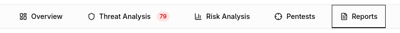
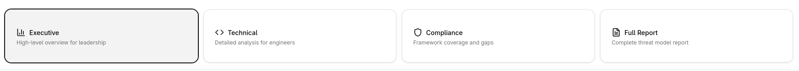
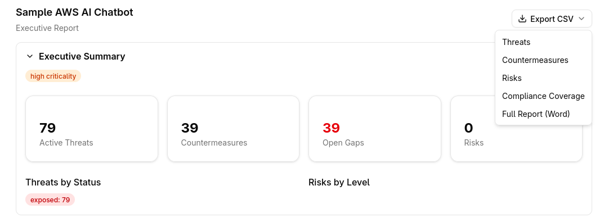

# Report Generation

Precogly generates threat model reports that serve as evidence artifacts for stakeholders, auditors, and compliance teams. Reports are rendered client-side from data returned by the `/api/threat-models/{id}/report/` endpoint, so they always reflect the current state of your threat model.

## Accessing the report view

Open a threat model from the dashboard, then select the **Report** tab in the workspace sidebar. The report view loads automatically and defaults to the Executive report type.

## Choosing a report type

Four report types are available. Click the corresponding card at the top of the report view to switch between them.

### Executive

High-level overview for leadership. Surfaces the STRIDE summary, countermeasure status, top gaps, risk register, and critical findings without exposing low-level threat or component details. Scope and compliance coverage appear in summary form; assumptions are limited to flagged items only.

### Technical

Detailed analysis for engineers. Includes full architecture, data assets, components and data flows, individual threat detail (including dismissed threats), all countermeasure categories (status, gaps, waived, and inherited), and a complete findings and action items list. The risk register is shown in summary form.

### Compliance

Audit-ready view organized around framework coverage. Contains the full compliance mapping and cross-framework mappings, dismissed threats, all countermeasure categories, the risk register, assumptions review, compliance-specific findings, and a completion status checklist. Data assets and the STRIDE summary appear in summary form.

### Full Report

Every section at full depth. Includes all 18 sections listed in the reference table below with no filtering or summarization.

## Report sections reference

The table below shows which sections appear in each report type. **Full** means the section is shown at full detail; **Summary** means a condensed version; other labels indicate specific filtering (e.g., only flagged assumptions or only critical findings).

| Section                  | Executive | Technical | Compliance | Full |
|--------------------------|-----------|-----------|------------|------|
| Executive Summary        | Full      | --        | --         | Full |
| Scope and Assumptions    | Summary   | Summary   | Full       | Full |
| Architecture             | --        | Full      | --         | Full |
| Data Assets              | --        | Full      | Summary    | Full |
| Components and Data Flows| --        | Full      | --         | Full |
| STRIDE Summary           | Full      | Full      | Summary    | Full |
| Threat Detail            | --        | Full      | --         | Full |
| Dismissed Threats        | --        | Full      | Full       | Full |
| Countermeasure Status    | Full      | Full      | Full       | Full |
| Gaps                     | Top 3     | Full      | Full       | Full |
| Waived Countermeasures   | Count     | Full      | Full       | Full |
| Inherited Countermeasures| --        | Full      | --         | Full |
| Risk Register            | Full      | Summary   | Full       | Full |
| Compliance Mapping       | Summary   | --        | Full       | Full |
| Cross-Framework Mappings | --        | --        | Full       | Full |
| Assumptions Review       | Flagged   | --        | Full       | Full |
| Findings                 | Critical  | Full      | Compliance | Full |
| Completion Status        | --        | --        | Full       | Full |

## Exporting reports

The **Export CSV** dropdown in the top-right corner of the report view provides five export options.

### CSV exports

Four separate CSV files are available, each covering one domain of the threat model:

- **Threats** -- all identified threats and their attributes
- **Countermeasures** -- countermeasure status, ownership, and mapping
- **Risks** -- risk register entries with severity and likelihood
- **Compliance Coverage** -- framework control mappings and coverage status

Click the desired item in the dropdown to download the corresponding CSV file immediately.

### Word export

Select **Full Report (Word)** from the same dropdown to generate a `.docx` document containing the complete report. The Word export packages all sections into a single file suitable for offline review or distribution to stakeholders who do not have Precogly access.

## Tips

| Audience              | Recommended report type |
|-----------------------|-------------------------|
| C-suite / board       | Executive               |
| Security engineers    | Technical               |
| Auditors / GRC teams  | Compliance              |
| Internal archive      | Full                    |

- Switch between report types freely. The underlying data is the same; only the sections and their depth change.
- Use CSV exports when you need to import threat or compliance data into spreadsheets or external tools.
- Use the Word export to share a self-contained report with reviewers outside the platform.
